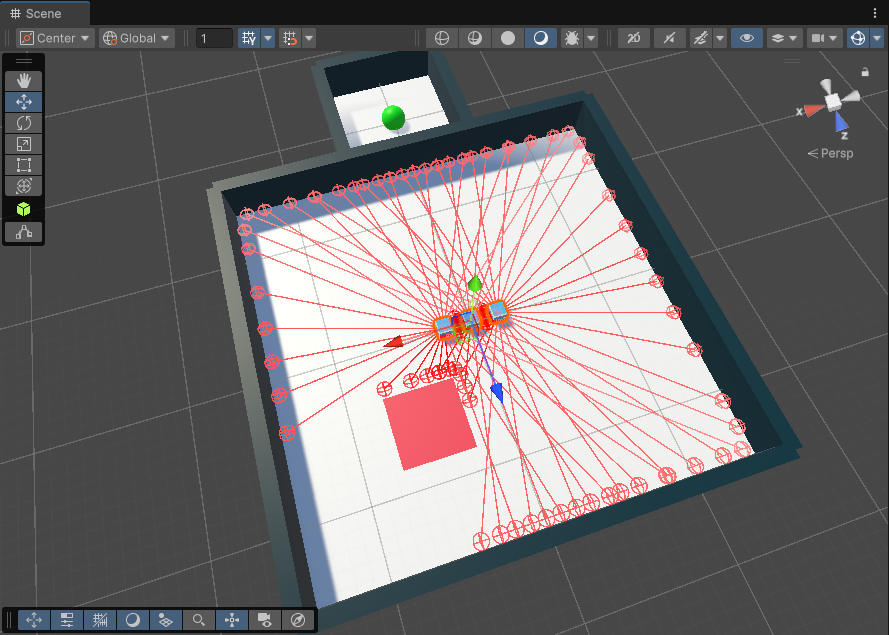

# 2025-summer-mogakso-project
***

### 프로젝트 설명

- 다수의 에이전트가 공동의 목표 달성을 위해 협력
- 에이전트 별 보상이 아닌, 공동 목표 달성 시 그룹 보상 제공
- 따라서 그룹 보상을 최대화하도록 학습을 진행함
- 파란색 큐브 - Agent
- 빨간색 평면 - Trap
- 초록색 구 - Goal

- Scene 화면

  

  - 각 Agent에는 30개의 Sensor가 존재
  - Sensor는 ray를 통해 주변의 GameObject를 인식하고 구분할 수 있음

- 실행 화면

  

- 적용 알고리즘  
  - Multi-Agent POsthumous Credit Assignment (MA-POCA)  
    COunterfactual Multi-Agent (COMA) Policy Gradient 기법에 self attention을 적용한 기법

***

### Multi-Agent
- 하나의 환경 내에 다수의 에이전트가 존재
  - 다수의 에이전트를 동시에 제어하며 서로 협력하거나 경쟁하도록 학습 진행
  - 공동의 목표를 해결하는 경우 각 에이전트에게 그룹 보상 제공
- 실생활의 많은 문제가 멀티에이전트 시스템으로 정의될 수 있음
  - 물류 로봇, 자율주행, 드론 군집 제어, 네트워크 최적화, 신호등 제어, 등
- Unity ML-Agents에서 제공하는 기능
  - 스크립트 작성 시 SimpleMultiAgentGroup 클래스를 기반으로 멀티 에이전트 학습을 위한 설정 수행

### 특징
- SimpleMultiAgentGroup 클래스를 활용해 다중 에이전트에 대해 단체 보상 제공 및 에피소드 종료 함수 사용
- Ray Perception Sensor를 활용하여 ray를 기반으로 에이전트 주변 물체들과의 거리와 상태를 인지

### 환경 설명
- 에이전트는 상하좌우로 이동
- 에이전트가 빨간 사각형과 충돌 시 해당 에이전트가 파괴됨
- 에이전트가 파괴되며 목표 지점으로 이동이 가능해짐
- 남은 에이전트 중 하나가 목표 지점에 도달하면 성공

### 에이전트 설정
- 보상
  - 목표 지점 도달하는 경우 +1
- 종료 조건
  - 목표 지점 도달하는 경우
  - 모든 에이전트가 파괴되는 경우
  - Max Step만큼 경과하는 경우 (2000 스텝)

***

### 코드 작성

#### Environment Controller
```cs
using UnityEngine;
using Unity.MLAgents;
using System.Collections.Generic;
using System;
using Random = UnityEngine.Random;

public class EnvController : MonoBehaviour
{
    [Serializable]
    public class PlayerInfo
    {
        public BlockAgent agent;
        public Vector3 startPos;
        public Rigidbody agentRb;
    }

    public List<PlayerInfo> AgentList = new List<PlayerInfo>();
    public int maxEnvSteps = 2000;
    public GameObject ground;
    public GameObject door;
    public GameObject trap;

    private int trapDir = 1;
    private int resetTimer;
    private Bounds areaBounds;
    private float areaPosX;

    private SimpleMultiAgentGroup agentGroup;
    public int remainPlayers;
    private float spawnMarginMultiplier = 0.8f;

    private void Start()
    {
        areaPosX = transform.position.x;
        areaBounds = ground.GetComponent<Collider>().bounds;
        agentGroup = new SimpleMultiAgentGroup();
        foreach (var block in AgentList)
        {
            block.startPos = block.agent.transform.position;
            block.agentRb = block.agent.GetComponent<Rigidbody>();
            agentGroup.RegisterAgent(block.agent);
        }
        remainPlayers = AgentList.Count;

        ResetScene();
    }

    private void FixedUpdate()
    {
        resetTimer += 1;
        if (resetTimer > maxEnvSteps)
        {
            agentGroup.GroupEpisodeInterrupted();
            ResetScene();
        }

        MoveTrap();
    }

    public void GoalReached()
    {
        agentGroup.AddGroupReward(1f);
        agentGroup.EndGroupEpisode();
    }

    public void OpenDoor()
    {
        door.gameObject.SetActive(false);
    }

    public void CloseDoor()
    {
        door.gameObject.SetActive(true);
    }

    public void KillAgent(BlockAgent agent)
    {
        remainPlayers--;
        if (remainPlayers == 0)
        {
            agentGroup.EndGroupEpisode();
            ResetScene();
        }
        else
        {
            agent.gameObject.SetActive(false);
            OpenDoor();
        }
    }

    public void MoveTrap()
    {
        if (trap.transform.position.x >= 12 + areaPosX || trap.transform.position.x <= -12 + areaPosX)
            trapDir *= -1;

        trap.transform.position = new Vector3(trap.transform.position.x + trapDir * 0.1f, trap.transform.position.y, trap.transform.position.z);
    }

    private List<Vector2> GetRandomSpawnPos()
    {
        List<Vector2> randPosList = new List<Vector2>();
        for (int i = 0; i < 4; i++)
        {
            Vector2 randPos = new Vector2();
            while (true)
            {
                randPos = new Vector2(ground.transform.position.x,
                                      ground.transform.position.z)
                        + new Vector2(Random.Range(-areaBounds.extents.x * spawnMarginMultiplier, areaBounds.extents.x * spawnMarginMultiplier),
                                      Random.Range(-areaBounds.extents.z * spawnMarginMultiplier, areaBounds.extents.z * spawnMarginMultiplier));

                bool repeat = false;
                foreach (Vector2 tempPos in randPosList)
                {
                    if (Vector2.Distance(tempPos, randPos) <= 5.0f)
                    {
                        repeat = true;
                        break;
                    }
                }
                if (!repeat) break;
            }
            randPosList.Add(randPos);
        }
        return randPosList;
    }

    private void ResetScene()
    {
        List<Vector2> randPosList = GetRandomSpawnPos();

        trap.transform.position = new Vector3(randPosList[0].x, 0.01f, randPosList[0].y);

        int index = 1;
        foreach (var agent in AgentList)
        {
            var pos = new Vector3(randPosList[index].x, 0.5f, randPosList[index].y);
            agent.agent.transform.position = pos;
            agent.agentRb.linearVelocity = Vector3.zero;
            agent.agentRb.angularVelocity = Vector3.zero;
            agent.agent.gameObject.SetActive(true);

            agentGroup.RegisterAgent(agent.agent);
            index++;
        }
        resetTimer = 0;
        remainPlayers = AgentList.Count;
        CloseDoor();
    }
}
```

#### Agent
```cs
using UnityEngine;
using Unity.MLAgents;
using Unity.MLAgents.Actuators;
using Unity.MLAgents.Sensors;

public class BlockAgent : Agent
{
    private Rigidbody agentRb;
    private EnvController ec;
    private float runSpeed = 2.5f;

    public float waitingTime = 0.01f;
    float currTime = 0f;

    public override void Initialize()
    {
        ec = GetComponentInParent<EnvController>();
        agentRb = GetComponent<Rigidbody>();

        Academy.Instance.AgentPreStep += WaitTimeInference;
    }

    public override void CollectObservations(VectorSensor sensor)
    {
        sensor.AddObservation(ec.remainPlayers);
        sensor.AddObservation(agentRb.linearVelocity);
    }

    private void MoveAgent(ActionSegment<int> act)
    {
        var moveDir = Vector3.zero;

        var action = act[0];

        switch(action)
        {
            case 1:
                moveDir = transform.forward * 1f;
                break;
            case 2:
                moveDir = transform.forward * -1f;
                break;
            case 3:
                moveDir = transform.right * -1f;
                break;
            case 4:
                moveDir = transform.right * 1f;
                break;
        }
        agentRb.AddForce(moveDir * runSpeed, ForceMode.VelocityChange);
    }

    public override void OnActionReceived(ActionBuffers actionBuffers)
    {
        MoveAgent(actionBuffers.DiscreteActions);
    }

    private void OnCollisionEnter(Collision collision)
    {
        if (collision.gameObject.CompareTag("goal"))
        {
            ec.GoalReached();
        }
    }

    private void OnTriggerEnter(Collider collision)
    {
        if (collision.gameObject.CompareTag("trap"))
        {
            ec.KillAgent(this);
        }
    }

    public override void Heuristic(in ActionBuffers actionsOut)
    {
        var discreteActionsOut = actionsOut.DiscreteActions;
        if (Input.GetKey(KeyCode.W))
            discreteActionsOut[0] = 1;
        else if (Input.GetKey(KeyCode.S))
            discreteActionsOut[0] = 2;
        else if (Input.GetKey(KeyCode.A))
            discreteActionsOut[0] = 3;
        else if (Input.GetKey(KeyCode.D))
            discreteActionsOut[0] = 4;
    }

    public void WaitTimeInference(int action)
    {
        if (Academy.Instance.IsCommunicatorOn)
            RequestDecision();
        else
        {
            if (currTime >= waitingTime)
            {
                currTime = 0f;
                RequestDecision();
            }
            else
            {
                currTime += Time.fixedDeltaTime;
            }
        }
    }
}
```

***

### 학습 진행

#### 프로젝트 폴더로 이동
```bash
cd Desktop\2025-summer-mogakso-project
```
#### ML-Agents 학습 시작
```bash
mlagents-learn block.yaml --env="./builds/yoonbyungsun-project" --run-id=BlockAgent
```
#### TensorBoard로 결과 확인
```bash
tensorboard --logdir=results --port=6006
```

***

### 학습 결과

#### Group Cmulative Reward Graph


#### Episode Length Graph


#### 1. Group Reward 그래프 분석
- **초반 (0~200k step)**  
  - 보상 값이 빠르게 상승
  - Agent가 기본 정책을 학습하며 안정화되는 구간
- **중반 (200k~800k step)**
  - 보상이 급격히 변동하는 구간 반복
  - 보상의 값이 일부 구간에서 특정 값(0)으로 기록되는 것으로 보아, 모델의 성능 또는 Episode의 난이도와는 무관한 결과로 예상됨
  - Episode Length 그래프의 등락 구간과 Reward 그래프의 등락 구간이 일치함
  - Episode의 timeout 또는 reset으로 인한 episode 종료가 원인으로 보임
- **후반 (800k~1.7M step)**
  - 성능이 안정화되는 구간
  - 최종 Value는 0.995로 1.0에 수렴

#### 2. Episode Length 그래프
- Episode의 길이가 수백~수천 step으로 늘어난 경우, MaxStep에 도달하여 종료됨
- 이 경우, 성공 보상 없이 종료 되어 (누적보상=0)으로 기록됨
- 최종적으로 학습이 안정화되면서 episode 길이도 50 스텝 내외로 수렴하였음
- 즉, 안정적인 학습이 진행되었음을 확인할 수 있음

#### 3. 결론
- **성능 측면**  
  reward 값이 최종적으로 0.995에 도달하였음
- **안정성 측면**  
  일부 구간에서 reward의 값이 0으로 기록되었으나, 환경 설계 상의 종료 조건으로 인한 결과이며, 최종 결과에는 큰 문제가 되지 않음
- **개선 사항**  
  MaxStep 경과로 인한 episode 종료 시, ```EpisodeInterrupted()``` 또는 ```GroupEpisodeInterrupted()```를 통해 무보상 학습을 방지

#### 4. 총평
- Multi-Agent의 공동 목표 달성 정책을 성공적으로 학습했으며, 성능은 우수함
- 그래프 상의 급격한 등락은 Episode 종료 조건에 따른 결과이며, 실제 성능 저하는 아님
- Episode의 종료 조건을 개선하면, 훨씬 안정적인 학습이 가능할 것으로 보임